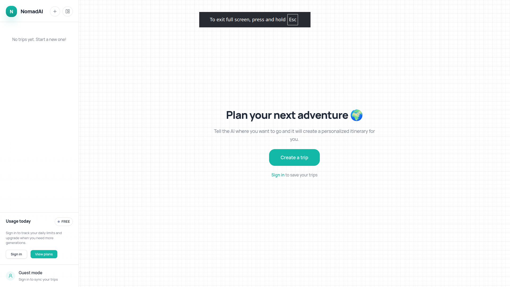
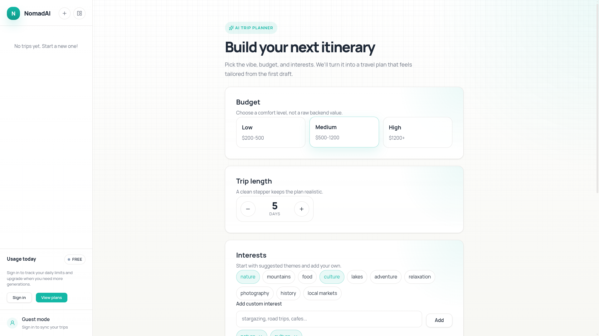
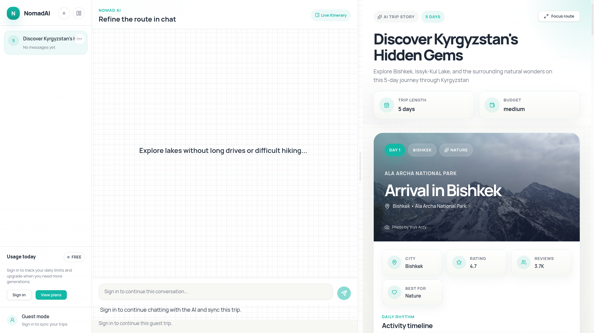
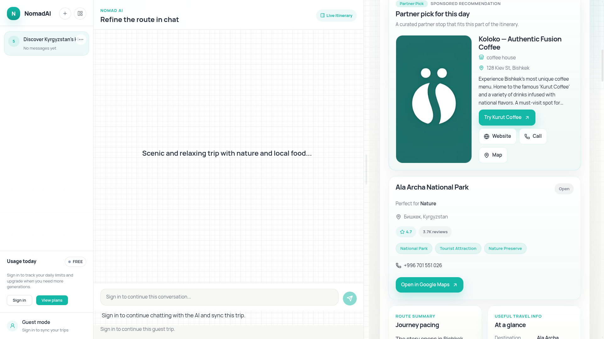
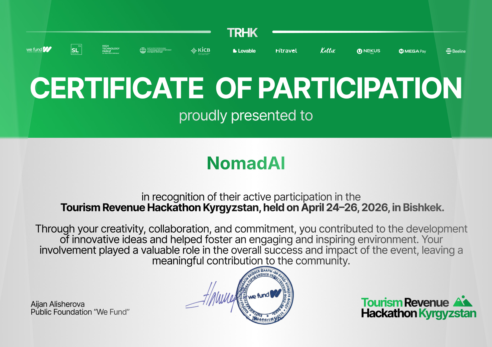

<div align="center" >

# 🧭 NomadAI

**AI-powered travel planning platform for Kyrgyzstan — from chat prompt to full trip workspace**

[](https://fastapi.tiangolo.com/)
[](https://www.postgresql.org/)
[](https://react.dev/)
[](https://www.typescriptlang.org/)
[](https://groq.com/)
[](LICENSE)

[User App](https://nomad-ai-client.vercel.app) · [Business Panel](https://nomad-ai-pi.vercel.app) · [API Docs](#api-documentation)
---

# Screenshots




</div>

---

## What is NomadAI?

NomadAI is an AI travel assistant built specifically for trips across Kyrgyzstan. A user describes their budget, travel style, duration, and interests — and the platform generates a structured multi-day itinerary with real places, transport estimates, routes, and practical tips.

Unlike a one-shot AI response, NomadAI is a persistent travel workspace. Trips are saved to your account, the AI conversation continues across sessions, and the itinerary updates live as you refine it.

```
Guest or User → AI Itinerary (Groq) → Google Places & Routes → Pexels Photos → Sponsored Injection → Saved Trip
```

---

## Key Features

### For Travelers

- **Try it instantly as a guest** — No account needed to generate your first trip. Enter preferences and get a full itinerary immediately.
- **AI Trip Generation** — Powered by Groq. Describe budget, duration, interests, and travel style. Get a structured day-by-day plan tailored to Kyrgyzstan.
- **Real Routes via Google** — The right panel shows day-by-day route structure, distances, estimated travel times, and approximate transport costs using the Google Places & Routes APIs.
- **Photo-Rich Itineraries** — Each day is enriched with contextual photography via the Pexels API.
- **Conversational Editing** — Chat with AI to refine your trip: *"make it cheaper"*, *"add Issyk-Kul"*, *"less walking on day 3"*. Only changed days are re-enriched — no wasted API calls.
- **Persistent Trip History** — Register to save trips, continue conversations later, and build a personal travel workspace across sessions.
- **Export** — Authenticated users can download their trip plans.

### Guest Mode

- A non-authenticated user can generate one initial trip.
- The trip is temporarily stored in `localStorage` on the client.
- After sign-in or registration, the guest trip is synced to the authenticated account and persisted in PostgreSQL.
- Without an account, conversation continuation and export are unavailable.

### For Businesses

- **Business Profiles** — Create and manage a business presence on the platform.
- **Sponsored Places** — Submit locations that are natively injected into relevant AI itineraries — not as banner ads, but as contextual recommendations inside the route.
- **Media Uploads** — Attach photos per sponsored place via multipart upload. Fallback SVG icons for missing media.
- **Analytics Dashboard** — Track impressions (injections into itineraries) and interactions (clicks, map opens, calls, saves) with CTR breakdown.

### For Admins

- **User Management** — View users, assign roles (USER / BUSINESS / ADMIN), protected from accidentally removing the last admin.
- **Subscription Plans** — Create and manage plans with configurable generation and edit limits. Activate or deactivate tiers.
- **Sponsored Place Moderation** — Approve, reject, activate, or deactivate sponsored places before they appear in itineraries.

---

## UI Structure

The product is split across four main screens:

| Screen | Description |
|---|---|
| **Landing / Home** | Hero section, trip input form, guest CTA, login/register |
| **Trip Workspace** | Left: AI chat. Right: structured itinerary, day cards, route info, cost estimates, map |
| **My Trips** | Saved trip cards with date metadata and reopen action |
| **Auth** | Login, registration, guest-to-account transfer |

---

## User Flow

```
1. User opens the site
        │
        ▼
2. Guest enters budget, days, interests, travel style
        │
        ▼
3. System generates trip via Groq + enriches with Google Maps + Pexels
        │
        ▼
4. Guest previews result
        │
        ├── Wants to continue chat or export?
        │       └── Prompted to sign in / register
        │
        ▼
5. Guest trip synced from localStorage → PostgreSQL on sign-in
        │
        ▼
6. User returns later → My Trips → resumes conversation
        │
        ▼
7. Groq receives prior chat context → updates existing itinerary
```

---

## Architecture

### Backend Pipeline — Trip Creation

```
POST /trips/generate
       │
       ▼
  Groq AI ──► Normalize result
       │       (validate days, fix locations, clean activity types)
       ▼
  Google Places & Routes API ──► Route segments, distances, transport cost estimates
       │
       ▼
  Pexels API ──► Day-level photography
       │
       ▼
  SponsoredInjectionService
       │   - matches city + category + distance
       │   - injects into day.sponsored
       ▼
  Save Trip + Initial Chat Messages
       │
       ▼
  Return to Frontend
```

### Backend Pipeline — AI Chat Edit

```
POST /trips/{id}/messages
       │
       ▼
  Groq updates itinerary (with full prior context)
       │
       ▼
  Detect changed days
       │
       ├── Google Maps route refresh (changed days only)
       ├── Pexels refresh (changed days only)
       └── Re-inject sponsored places
       │
       ▼
  Save updated trip + chat message
```

### Guest Trip Sync

```
POST /trips/sync-guest
       │
       ▼
  Read trip from client localStorage
       │
       ▼
  Associate with authenticated user_id
       │
       ▼
  Persist to PostgreSQL
```

---

## Tech Stack

| Layer | Technology |
|---|---|
| Frontend | React + Vite + TypeScript |
| Backend | FastAPI + SQLAlchemy + Alembic |
| Database | PostgreSQL |
| AI Provider | Groq |
| Maps & Routing | Google Places & Routes API |
| Images | Pexels API |
| Auth | JWT |
| File Storage | Local filesystem via FastAPI static |
| Guest Persistence | `localStorage` (client-side, pre-auth) |

---

## Data Model

```
User
  id, email, password_hash, plan_type, created_at

Trip
  id, user_id (nullable for guest), title, budget, days,
  interests, travel_style, itinerary_json, created_at, updated_at

TripMessage
  id, trip_id, role, content, created_at

RouteSegment (optional normalized entity)
  id, trip_id, from_location, to_location,
  distance, duration, estimated_cost, transport_type
```

---

## API Documentation

All endpoints are documented via Swagger UI at `/docs` when running locally.

| Method | Endpoint | Description | Auth |
|---|---|---|---|
| `POST` | `/auth/register` | Create user account | — |
| `POST` | `/auth/login` | Authenticate user | — |
| `POST` | `/trips/generate` | Create a new trip | Guest or user |
| `GET` | `/trips` | List saved trips | Required |
| `GET` | `/trips/{id}` | Get trip with chat context | Required |
| `POST` | `/trips/{id}/messages` | Continue AI conversation | Required |
| `POST` | `/trips/sync-guest` | Sync guest trip after login | Required |

**Additional API groups:**

| Group | Description |
|---|---|
| `subscriptions` | Plans, user subscriptions, mock purchase |
| `business` | Business profiles and sponsored places |
| `admin` | User management, plan management, moderation |
| `sponsored analytics` | Impressions, interactions, CTR |

---

## Monetization

**B2C — Subscriptions** *(roadmap)*

| Plan | Trip Generations/day | AI Edits | Export |
|---|---|---|---|
| Free | 1 | Limited | — |
| Pro | More | Unlimited | ✓ |

**B2B — Sponsored Places** *(implemented)*

Businesses pay to have their location natively injected into relevant AI itineraries. The injection engine matches by city, activity category, and proximity. Businesses see impressions and interaction analytics to measure ROI.

**B2B — Partner Commissions** *(roadmap)*

Future commission model with tourism partners: hotels, tours, transport providers, and experience vendors.

---

## Getting Started

### Prerequisites

- Python 3.11+
- Node.js 18+
- PostgreSQL
- Groq API key
- Google Cloud project with Places API and Routes API enabled
- Pexels API key

### Backend

```bash
cd backend
cp .env.example .env
python -m venv venv
source venv/bin/activate
pip install -r requirements.txt
```


### Run Migrations & Start

```bash
docker compose up -d 
alembic upgrade head
```

API: `http://localhost:8000`  
Swagger: `http://localhost:8000/docs`

### User Frontend

```bash
cd frontend
cp .env.example .env
npm install
npm run dev
```

### Business Panel

```bash
cd businessPanel
cp .env.example .env
npm install
npm run dev
```
---

## User Roles

| Role | Capabilities |
|---|---|
| `USER` | Generate trips, chat edits, trip history, export, subscriptions |
| `BUSINESS` | All USER capabilities + business profile + sponsored places + analytics |
| `ADMIN` | All capabilities + user management + plan management + moderation |

---

## Media Architecture

Sponsored place images are stored per-place:

```
/media/businesses/{business_id}/sponsored_places/{place_id}/{filename}
```

Fallback for missing images:
```
/media/defaults/restaurant.svg
```

Files are served directly by FastAPI via the `/media` static route.

---

## Live Deployments

| Interface | URL |
|---|---|
| User App | [nomad-ai-client.vercel.app](https://nomad-ai-client.vercel.app) |
| Business Panel | [nomad-ai-pi.vercel.app](https://nomad-ai-pi.vercel.app) |

---
# Hackaton Certificate


---

Copyright © 2026 LemmingLabs. All rights reserved.Unauthorized copying, distribution, or use of this file and its contents, via any medium, is strictly prohibited.
